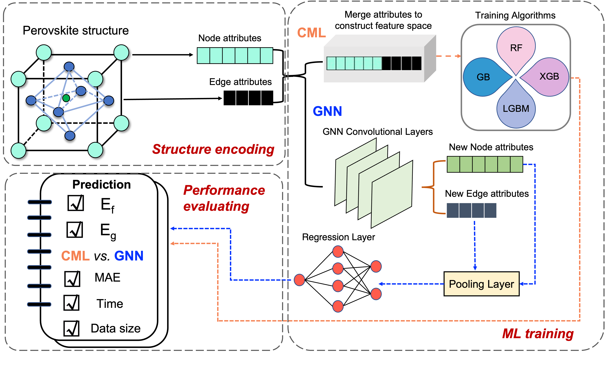
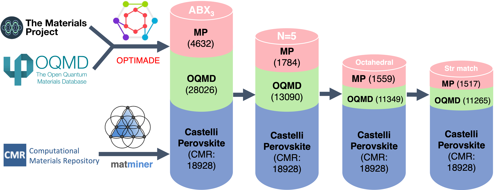

# Perovskite-ML
Comparative Analysis of Classical Machine Learning and Graph Neural Network Models for Perovskite Property Prediction

## Workflow
In this paper, we employ four classical machine learning models and four graph neural network models to predict the formation energy and band gap of perovskite materials across three datasets. Subsequently, we conducted a comparison of these models based on their accuracy and efficiency outcomes.

## Dataset
We extract perovskites data from three datasets: 
(1) The Materials Project Dataset
(2) Open Quantum Materials Database
(3) Computational Materials Repository Castelli−perovskites database

## Name Notation
File end with `fm` mean formation energy, `bg` means band gap.
